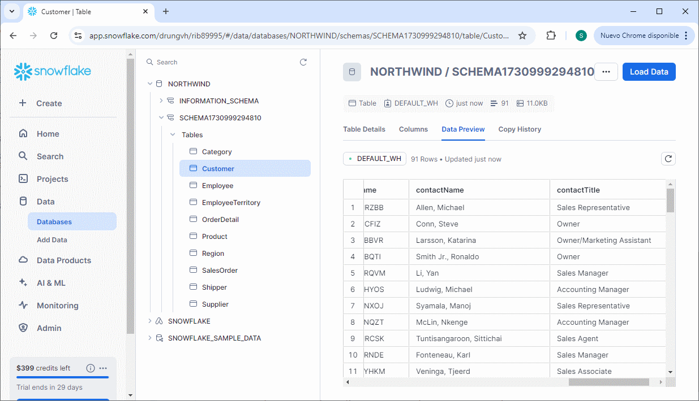

# snowflakedataapp

This is a sample nodejs app using [Snowflake](snowflake.com) that loads the [Northwind database](https://github.com/harryho/db-samples) into a new schema and creates a series of express endpoints per table.



## Sign up for Snowflake

Go to Snowflake and create a free account:

https://signup.snowflake.com/

Create a warehouse called `DEFAULT_WH` and a database called `Northwind`. 

Then create a new `.env` file in the root of your repository as follows

```
SNOWFLAKE_USER=<your username>
SNOWFLAKE_PASSWORD=<your passoword>
SNOWFLAKE_ACCOUNT=<your org>-<your account>
SNOWFLAKE_APP=snowflakedataapp
```

## Install

Make sure you have [Node.js](nodejs.org) version 20+ installed.

```sh
npm i
```

## Start

```sh
> npm start
```

You will see the following output

```sh
Successfully connected to Snowflake.... true
Using Northwind...
SQL> USE DATABASE Northwind
preloading schema schema1730998600292 [
  'Category',
  'Customer',
  'Employee',
  'EmployeeTerritory',
  'OrderDetail',
  'Product',
  'Region',
  'SalesOrder',
  'Shipper',
  'Supplier',
  'Territory'
]
SQL> CREATE SCHEMA IF NOT EXISTS schema1730998600292
SQL> USE SCHEMA schema1730998600292
{
  record: {
    picture: null,
    entityId: 1,
    description: 'Soft drinks, coffees, teas, beers, and ales',
    categoryName: 'Beverages'
  }
}
SQL> CREATE TABLE IF NOT EXISTS "Category" ("picture" VARCHAR, "entityId" INT, "description" VARCHAR, "categoryName" VARCHAR)
SQL> INSERT INTO "Category" VALUES (?,?,?,?)
{
  record: {
    fax: '030-0123456',
    city: 'Berlin',
    email: null,
    phone: '030-3456789',
    mobile: null,
    region: null,
    address: 'Obere Str. 0123',
    country: 'Germany',
    entityId: 1,
    postalCode: '10092',
    companyName: 'Customer NRZBB',
    contactName: 'Allen, Michael',
    contactTitle: 'Sales Representative'
  }
}
SQL> CREATE TABLE IF NOT EXISTS "Customer" ("fax" VARCHAR, "city" VARCHAR, "email" VARCHAR, "phone" VARCHAR, "mobile" VARCHAR, "region" VARCHAR, "address" VARCHAR, "country" VARCHAR, "entityId" INT, "postalCode" VARCHAR, "companyName" VARCHAR, "contactName" VARCHAR, "contactTitle" VARCHAR)
SQL> INSERT INTO "Customer" VALUES (?,?,?,?,?,?,?,?,?,?,?,?,?)
{
  record: {
    city: 'Seattle',
    email: null,
    mgrId: null,
    notes: null,
    phone: '(206) 555-0101',
    photo: null,
    title: 'CEO',
    mobile: null,
    region: 'WA',
    address: '7890 - 20th Ave. E., Apt. 2A',
    country: 'USA',
    entityId: 1,
    hireDate: '2002-05-01 00:00:00.000000',
    lastname: 'Davis',
    birthDate: '1958-12-08 00:00:00.000000',
    extension: null,
    firstname: 'Sara',
    photoPath: null,
    postalCode: '10003',
    titleOfCourtesy: 'Ms.'
  }
}
SQL> CREATE TABLE IF NOT EXISTS "Employee" ("city" VARCHAR, "email" VARCHAR, "mgrId" INT, "notes" VARCHAR, "phone" VARCHAR, "photo" VARCHAR, "title" VARCHAR, "mobile" VARCHAR, "region" VARCHAR, "address" VARCHAR, "country" VARCHAR, "entityId" INT, "hireDate" VARCHAR, "lastname" VARCHAR, "birthDate" VARCHAR, "extension" VARCHAR, "firstname" VARCHAR, "photoPath" VARCHAR, "postalCode" VARCHAR, "titleOfCourtesy" VARCHAR)      
SQL> INSERT INTO "Employee" VALUES (?,?,?,?,?,?,?,?,?,?,?,?,?,?,?,?,?,?,?,?)
{ record: { entityId: 1, employeeId: 1, territoryCode: '06897' } }
SQL> CREATE TABLE IF NOT EXISTS "EmployeeTerritory" ("entityId" INT, "employeeId" INT, "territoryCode" VARCHAR)
SQL> INSERT INTO "EmployeeTerritory" VALUES (?,?,?)
{
  record: {
    orderId: 10248,
    discount: 0,
    entityId: 1,
    quantity: 12,
    productId: 11,
    unitPrice: 14
  }
}
SQL> CREATE TABLE IF NOT EXISTS "OrderDetail" ("orderId" INT, "discount" INT, "entityId" INT, "quantity" INT, "productId" INT, "unitPrice" INT)
SQL> INSERT INTO "OrderDetail" VALUES (?,?,?,?,?,?)
{
  record: {
    entityId: 1,
    unitPrice: 18,
    categoryId: 1,
    supplierId: 1,
    productName: 'Product HHYDP',
    discontinued: '0',
    reorderLevel: null,
    unitsInStock: null,
    unitsOnOrder: null,
    quantityPerUnit: null
  }
}
SQL> CREATE TABLE IF NOT EXISTS "Product" ("entityId" INT, "unitPrice" INT, "categoryId" INT, "supplierId" INT, "productName" VARCHAR, "discontinued" VARCHAR, "reorderLevel" VARCHAR, "unitsInStock" INT, "unitsOnOrder" INT, "quantityPerUnit" INT)
SQL> INSERT INTO "Product" VALUES (?,?,?,?,?,?,?,?,?,?)
{ record: { entityId: 1, regiondescription: 'Eastern' } }
SQL> CREATE TABLE IF NOT EXISTS "Region" ("entityId" INT, "regiondescription" VARCHAR)
SQL> INSERT INTO "Region" VALUES (?,?)
{
  record: {
    freight: 32.38,
    entityId: 10248,
    shipCity: 'Reims',
    shipName: 'Ship to 85-B',
    orderDate: '2006-07-04 00:00:00.000000',
    shipperId: 3,
    customerId: 85,
    employeeId: 5,
    shipRegion: null,
    shipAddress: "6789 rue de l'Abbaye",
    shipCountry: 'France',
    shippedDate: '2006-07-16 00:00:00.000000',
    requiredDate: '2006-08-01 00:00:00.000000',
    shipPostalCode: '10345'
  }
}
SQL> CREATE TABLE IF NOT EXISTS "SalesOrder" ("freight" INT, "entityId" INT, "shipCity" VARCHAR, "shipName" VARCHAR, "orderDate" VARCHAR, "shipperId" INT, "customerId" INT, "employeeId" INT, "shipRegion" VARCHAR, "shipAddress" VARCHAR, "shipCountry" VARCHAR, "shippedDate" VARCHAR, "requiredDate" VARCHAR, "shipPostalCode" VARCHAR)
SQL> INSERT INTO "SalesOrder" VALUES (?,?,?,?,?,?,?,?,?,?,?,?,?,?)
{
  record: {
    phone: '(503) 555-0137',
    entityId: 1,
    companyName: 'Shipper GVSUA'
  }
}
SQL> CREATE TABLE IF NOT EXISTS "Shipper" ("phone" VARCHAR, "entityId" INT, "companyName" VARCHAR)
SQL> INSERT INTO "Shipper" VALUES (?,?,?)
{
  record: {
    fax: null,
    city: 'London',
    email: null,
    phone: '(171) 456-7890',
    region: null,
    address: '2345 Gilbert St.',
    country: 'UK',
    HomePage: null,
    entityId: 1,
    postalCode: '10023',
    companyName: 'Supplier SWRXU',
    contactName: 'Adolphi, Stephan',
    contactTitle: 'Purchasing Manager'
  }
}
SQL> CREATE TABLE IF NOT EXISTS "Supplier" ("fax" VARCHAR, "city" VARCHAR, "email" VARCHAR, "phone" VARCHAR, "region" VARCHAR, "address" VARCHAR, "country" VARCHAR, "HomePage" VARCHAR, "entityId" INT, "postalCode" VARCHAR, "companyName" VARCHAR, "contactName" VARCHAR, "contactTitle" 
VARCHAR)
SQL> INSERT INTO "Supplier" VALUES (?,?,?,?,?,?,?,?,?,?,?,?,?)
{
  record: {
    entityId: 1,
    regionId: 1,
    territoryCode: '01581',
    territorydescription: 'Westboro'
  }
}
SQL> CREATE TABLE IF NOT EXISTS "Territory" ("entityId" INT, "regionId" INT, "territoryCode" VARCHAR, "territorydescription" VARCHAR)
SQL> INSERT INTO "Territory" VALUES (?,?,?,?)
Listening on port 3005
```

## Use the API

You can now query the Northwind database as follows:

```
GET http://localhost:3005/api/Customer

[
  {
    "entityId": 1,
    "contactName": "Allen, Michael",
    "contactTitle": "Sales Representative"
    "country": "Germany",
    "fax": "030-0123456",
    "city": "Berlin",
    "email": null,
    "phone": "030-3456789",
    "mobile": null,
    "region": null,
    "address": "Obere Str. 0123",
    "postalCode": "10092",
    "companyName": "Customer NRZBB",
  },
  ... Another 90 contacts
]
```